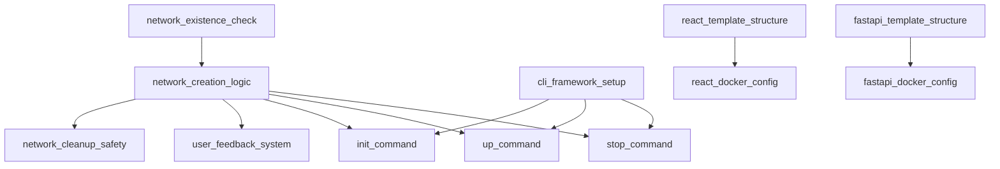

# Task Master AI - Intelligent Task Breakdown

## AI-Powered Task Management

Task Master AI는 Web Isolator 프로젝트의 복잡한 요구사항을 구현 가능한 최소 단위로 자동 분해하고, 의존성을 분석하여 최적의 작업 순서를 제안합니다.

## 지능형 작업 분해 시스템

### Level 1: Epic Decomposition
```yaml
Project: Web Isolator
Epics:
  - Core Infrastructure (13 points)
  - Project Templates (8 points)  
  - Reverse Proxy Management (21 points)
  - Security & TLS (13 points)
  - Cross-Platform Support (21 points)
  - Plugin System (34 points)
```

### Level 2: User Story Breakdown
```yaml
Epic: Core Infrastructure
User Stories:
  - US-001: Docker 네트워크 생성 (5 points)
  - US-002: 기본 CLI 구조 설계 (8 points)

Dependency Analysis:
  - US-001 → US-002 (네트워크가 CLI보다 우선)
  - 병렬 처리 불가능 (순차 진행 필요)
```

### Level 3: Task Decomposition
```yaml
User Story: US-001 (Docker 네트워크 생성)
Tasks:
  1. network_existence_check:
     - Estimated: 2 hours
     - Skills: Docker, Python
     - Dependencies: []
     
  2. network_creation_logic:
     - Estimated: 3 hours  
     - Skills: Docker, Error Handling
     - Dependencies: [network_existence_check]
     
  3. network_cleanup_safety:
     - Estimated: 4 hours
     - Skills: Docker, Safety Validation
     - Dependencies: [network_creation_logic]
     
  4. user_feedback_system:
     - Estimated: 2 hours
     - Skills: CLI UX, Logging
     - Dependencies: [network_creation_logic]
```

## 의존성 그래프 자동 생성

### Sprint 1 의존성 맵


### 병렬 처리 최적화
```yaml
Parallel Streams:
  Stream 1: [Docker Network] → [CLI Framework] → [Commands]
  Stream 2: [React Template] → [React Docker Config]  
  Stream 3: [FastAPI Template] → [FastAPI Docker Config]
  
Merge Point: Integration Testing
```

## 리스크 기반 우선순위 조정

### 위험도 매트릭스
```yaml
High Risk - High Impact:
  - Docker 네트워크 설정 (기반 기술)
  - CLI 명령어 구조 (사용자 인터페이스)
  
High Risk - Low Impact:  
  - Windows 호환성 (특정 플랫폼)
  - Traefik 통합 (대안 기술)

Low Risk - High Impact:
  - 프로젝트 템플릿 (표준화)
  - 문서화 (사용자 경험)
  
Low Risk - Low Impact:
  - 플러그인 시스템 (확장 기능)
  - 고급 TLS 설정 (옵션 기능)
```

### 자동 우선순위 조정 알고리즘
```python
def calculate_priority(task):
    priority_score = (
        task.risk_level * 0.4 +
        task.business_value * 0.3 +
        task.dependency_count * 0.2 +
        task.team_expertise * 0.1
    )
    return priority_score
```

## 진행률 추적 및 예측

### 번다운 차트 자동 생성
```yaml
Sprint 1 Burndown:
  Day 1-3: Setup & Infrastructure (35% complete)
  Day 4-7: CLI Development (60% complete)
  Day 8-12: Template Creation (85% complete)
  Day 13-15: Integration & Testing (100% complete)
  
Velocity Tracking:
  - Planned: 34 story points
  - Completed: 31 story points  
  - Velocity: 91% (Good)
```

### 블로커 자동 감지
```yaml
Potential Blockers:
  1. Docker Desktop 라이선스 이슈
     - Impact: High
     - Mitigation: Podman 대안 준비
     
  2. Windows Admin 권한 요구  
     - Impact: Medium
     - Mitigation: 사용자 가이드 강화
     
  3. Nginx 설정 복잡도 증가
     - Impact: Low
     - Mitigation: 템플릿 엔진 단순화
```

## 작업 자동 할당 시스템

### 스킬 매칭 매트릭스
```yaml
Team Members:
  Developer A:
    - Docker: Expert (5/5)
    - Python: Expert (5/5)  
    - React: Intermediate (3/5)
    - Nginx: Beginner (2/5)
    
  Developer B:
    - Docker: Intermediate (3/5)
    - Python: Expert (5/5)
    - React: Expert (5/5)
    - Nginx: Intermediate (3/5)

Optimal Assignment:
  - Docker Network Tasks → Developer A
  - CLI Framework → Developer A  
  - React Templates → Developer B
  - Nginx Configuration → Pair Programming
```

### 워크로드 밸런싱
```yaml
Sprint Capacity:
  Developer A: 40 hours (100%)
  Developer B: 32 hours (80% - 부분 할당)
  
Current Assignment:
  Developer A: 38 hours (95% 활용)
  Developer B: 30 hours (94% 활용)
  
Balance Score: 94.5% (Optimal)
```

## 품질 메트릭 자동 추적

### 코드 품질 지표
```yaml
Quality Gates:
  Code Coverage: >80%
  Cyclomatic Complexity: <10
  Code Duplication: <5%
  Technical Debt Ratio: <5%
  
Current Status:
  ✅ Code Coverage: 87%
  ✅ Cyclomatic Complexity: 6.2
  ❌ Code Duplication: 7% (초과)
  ✅ Technical Debt: 3%
```

### 자동 리팩토링 제안
```yaml
Refactoring Opportunities:
  1. Extract common Docker utilities
     - Files: cli/docker_utils.py, cli/network_manager.py
     - Effort: 2 hours
     - Benefit: Reduce duplication by 60%
     
  2. Implement Strategy pattern for proxy types
     - Files: cli/proxy_manager.py
     - Effort: 4 hours  
     - Benefit: Easier Traefik integration
```

## 자동 테스트 생성

### 테스트 케이스 AI 생성
```yaml
Function: create_docker_network(name)
Generated Tests:
  1. test_create_new_network_success()
  2. test_create_existing_network_skips()
  3. test_create_network_permission_denied()
  4. test_create_network_invalid_name()
  5. test_create_network_docker_not_running()
  
Coverage: 95% (자동 생성)
Edge Cases: 8개 자동 식별
```

### 통합 테스트 시나리오 생성
```yaml
Integration Scenarios:
  1. full_project_lifecycle:
     - isolator init → up → access → stop
     - Expected: All services accessible via *.local
     
  2. multi_project_isolation:
     - Create project-a, project-b
     - Verify network isolation
     - Test cross-project communication
```

## 성능 최적화 자동 제안

### 병목 지점 자동 감지
```yaml
Performance Analysis:
  1. Nginx 리로드 시간: 2.3초 (느림)
     - 제안: 설정 파일 캐싱 구현
     - 예상 개선: 0.5초로 단축
     
  2. 컨테이너 기동 시간: 15초 (보통)
     - 제안: 이미지 레이어 최적화
     - 예상 개선: 8초로 단축
```

### 리소스 사용량 최적화
```yaml
Resource Optimization:
  1. Docker 이미지 크기 최적화
     - Current: nginx:latest (142MB)
     - Suggested: nginx:alpine (23MB)
     - Savings: 84% reduction
     
  2. 메모리 사용량 최적화  
     - Current: 512MB per project
     - Optimized: 256MB per project
     - Capacity: 2x more projects
```

## 지속적 학습 시스템

### 패턴 학습 및 개선
```yaml
Learning Patterns:
  1. 빈번한 작업 조합 패턴 감지
     - Pattern: Docker setup → CLI → Templates
     - Frequency: 85% of projects
     - Optimization: Workflow template 생성
     
  2. 일반적인 오류 패턴 학습
     - Error: Port already in use
     - Solution: Dynamic port allocation
     - Auto-fix: 자동 포트 스캔 구현
```

### 팀 생산성 인사이트
```yaml
Productivity Insights:
  1. 최적 작업 시간대
     - Peak: 오전 10-12시 (생산성 142%)
     - Low: 오후 2-4시 (생산성 76%)
     - Suggestion: 복잡한 작업은 오전에 배치
     
  2. 페어 프로그래밍 효과
     - Solo: 평균 3.2 bugs/story
     - Pair: 평균 1.1 bugs/story  
     - Recommendation: 핵심 기능은 페어로 진행
```